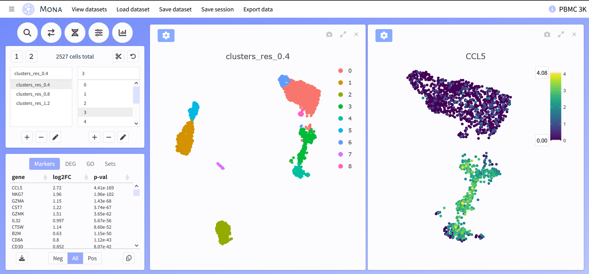

# Mona - Cell Explorer

Mona is an R package/Shiny application for single-cell data visualization, with the goal of allowing anyone to explore their data. It is built around three central ideas:


Ease - Focus on only the most important plots and options, quickly load and view large datasets, provide functions to prepare your own data

Interactivity - View multiple plots of multiple types at once, change/move/expand them seamlessly, use tools like zoom, pan, and select 

Design - Dedicate as much space to plots as possible, clearly organized, everything within a single page





Major features include:

- View up to 8 plots
- Full screen plots
- Split plots by metadata
- 3D embeddings
- Differential expression
- Volcano/MA plots
- Gene set scores
- Gene expression density
- Retrieve GO terms
- Reference-based label transfer


## Installation

Assuming you have R (and optionally, RStudio) already on your system, open R/RStudio and enter:

```
if (!require("remotes")) install.packages("remotes")
remotes::install_github("ZornLab/Mona")
```
There is additional software you may need to install outside of R: the hdf5 library and a C/C++ compiler. See the instructions for [BPCells](https://github.com/bnprks/BPCells) for more information.

## Getting started

Open Mona using the code below, which should launch it within your web browser.

```
library(Mona)
mona()
```

A test dataset is available to immediately begin trying out its features (see 'View datasets'). Users can also click the top left and view the 'Help' section for guidance on using Mona.

## Data preparation

If you are not familiar with single cell analysis, we recommended preparing your datasets with Mona's included functions, which try to follow best practices in Seurat. Here is an example for processing a single dataset: 

```
counts <- Read10X("raw_data/dataset")
seurat <- process_mona(counts)
```

We also provide a simple way to integrate multiple datasets together:

```
counts_list <- list(WT=counts_1,MUT=counts_2)
seurat <- integrate_mona(counts_list)
```

Mona works equally well with already processed data in Seurat or other formats. 

## Using Mona

All datasets must be converted into a 'Mona directory' before they can be viewed. Don't forget to also save a separate 'standard' version of the dataset, such as with 'saveRDS()'. For Seurat objects:

```
save_mona_dir(seurat,assay="SCT",dir="Desktop/my_dataset",name="Name",description="Description",species="human")
```

A Mona directory can also be constructed manually using three components - the lognorm counts, cell metadata, and a list of reductions. This is useful if working with anndata, SCE, etc.

```
save_mona_dir_custom(counts,meta,reduct,dir="Desktop/my_dataset",name="Name",description="Description",species="human")
```

The final step is to launch Mona, click 'Load dataset', and navigate to where the directory is stored. You can also open a dataset automatically when Mona launches by providing the path:

```
mona("Desktop/my_dataset")
```

Once finished, if you have edited the metadata/annotations make sure to save your changes with 'Save dataset'. Your current settings and gene sets can also be saved separately using 'Save session'. 

## Hosting

Like other Shiny apps, Mona can be hosted online to make it available to multiple users. There are many ways to do this, but you will likely want an 'app.R' file that launches Mona with the following arguments. This will provide a list of datasets to view and disables loading/modifying them.

```
mona(data_dir="/datasets/",load_data=FALSE,save_data=FALSE)
```

