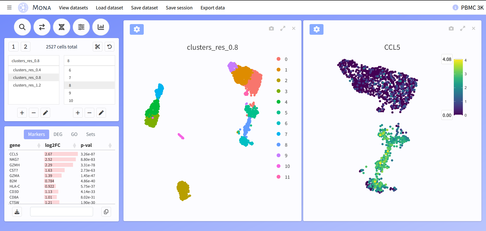

# Mona - Cell Explorer

Mona is an R package/Shiny application for single-cell data visualization, with the goal of allowing anyone to explore and annotate their data. It is focused on three central ideas:


Ease - Include only the most important functions and options, clearly organized, quickly load and view large datasets 

Interactivity - View multiple plots of multiple types at once, change/move/expand them seamlessly, use tools like zoom, pan, and select, 

Design - Dedicate as much space to plots as possible, everything within a single page





## Installation

Assuming you have R (and optionally, RStudio) already on your system, open R/RStudio and enter:

```
remotes::install_github("ZornLab/Mona")
```
There is additional software you may need to install outside of R: the hdf5 library and a C/C++ compiler. See the instructions for [BPCells](https://github.com/bnprks/BPCells) for more information.

## Getting started

Open Mona using the code below, which should launch it within your web browser. Mona is focused primarily on local use, but hosting is also possible.

```
library(Mona)
mona()
```

A test dataset is available to immediately begin trying out its features (see 'View datasets'). Users can also click the top left and view the 'Help' section for guidance on using Mona.

## Data preparation

If you are not familiar with single cell analysis, we recommended preparing your datasets with Mona's included functions, which try to follow the best practices in Seurat. Here is an example for processing a single dataset: 

```
counts <- Read10X("raw_data/dataset")
seurat <- process_mona(counts)
```

We also provide a simple way to integrate multiple datasets together:

```
counts_list <- list(WT=counts_1,MUT=counts_2)
seurat <- integrate_mona(counts_list)
```

Mona works equally well with already processed data in Seurat or other formats. 

## Using Mona

All datasets must be converted into a 'Mona directory' before they can be viewed. You should also always save a separate "standard" version of the dataset for future use. For Seurat objects:

```
save_mona_dir(seurat,assay="SCT",dir="Desktop/my_dataset",name="Name",description="Description",species="human")
saveRDS(seurat,file="my_dataset.rds")
```

Alternatively, if working with anndata, SCE, etc. then a Mona directory can be constructed manually using three components - the lognorm counts, cell metadata, and reductions.

```
save_mona_dir_custom(counts,meta,reduct,dir="Desktop/my_dataset",name="Name",description="Description",species="human")
```

The final step is to launch Mona, click 'Load new dataset', and navigate to where the directory is stored. You can also open a dataset automatically when Mona launches by providing the path:

```
mona("Desktop/my_dataset")
```

Once finished, if you have modified/annotated the dataset make sure to save your changes with 'Save dataset'. Your settings can be saved separately using 'Save session'. 

